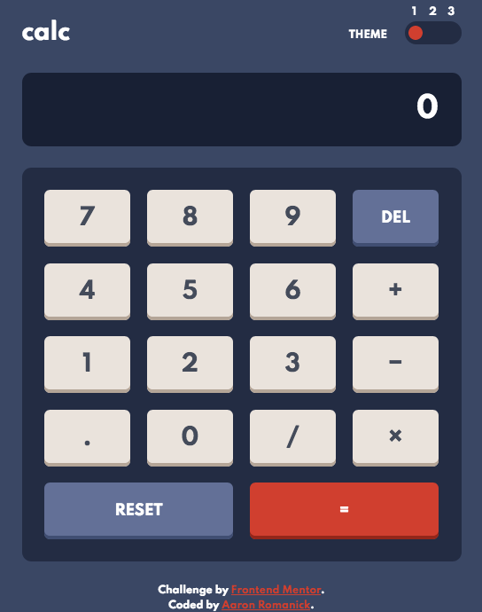

# Frontend Mentor - Calculator App Solution

This is a solution to the [Calculator app challenge on Frontend Mentor](https://www.frontendmentor.io/challenges/calculator-app-9lteq5N29). Frontend Mentor challenges help you improve your coding skills by building realistic projects. 

## Table of contents

- [Overview](#overview)
  - [The challenge](#the-challenge)
  - [Screenshot](#screenshot)
  - [Links](#links)
- [My process](#my-process)
  - [Built with](#built-with)
  - [What I learned](#what-i-learned)
  - [Continued development](#continued-development)
  - [Useful resources](#useful-resources)
- [Author](#author)
- [Acknowledgments](#acknowledgments)

## Overview

### The challenge

Users should be able to:

- See the size of the elements adjust based on their device's screen size
- Perform mathmatical operations like addition, subtraction, multiplication, and division
- Adjust the color theme based on their preference
- **Bonus**: Have their initial theme preference checked using `prefers-color-scheme` and have any additional changes saved in the browser

### Screenshot

### Links

- Solution URL: [https://www.frontendmentor.io/solutions/responsive-themeable-calculator-app-using-css-and-javascript-8odysCMOs](https://www.frontendmentor.io/solutions/responsive-themeable-calculator-app-using-css-and-javascript-8odysCMOs)
- Live Site URL: [https://nisenihonjin.github.io/calculator-app/](https://nisenihonjin.github.io/calculator-app/)

## My process

### Built with

- Semantic HTML5 markup
- CSS custom properties
- Flexbox
- Mobile-first workflow
- JavaScript

### What I learned

While I have a decent understanding of CSS and vanilla JavaScript, I hadn't ever used CSS variables nor incorporated theming into my projects, so those were firsts for me. Luckily, with a little reading, it didn't seem to be too much of an obstacle to incorporate. I knew from the get-go that I'd probably have to make good use of CSS variables to control the theme, and--while I'm not entirely satisfied with the outcome--I feel I did an adequate job organizing the theming aspects of the CSS. At first I thought about using CSS grid layout, but then I decided to use Flexbox instead for the button display.

The JavaScript took the most time, not so much because there was a lot of new ground, but moreso because I couldn't wrap my head around all the different paths one could take using a calculator. Coming into this challenge, I was very naive to think that a simple calculator wouldn't be that much work, but it turns out that there are a lot of irregular/edge cases that can happen when using a calculator. While just the basic functionality did take a long time, I also wanted to account for incredibly large/small numbers and generating appropriate errors. At first I had all my code in functions using the data attributes to hold JavaScript variable data, but then I switched to ES6 classes to remove some of that clutter (there still is a heavy bit of the data attributes being used).

I also wanted to make it so you could use the keyboard to input into the calculator with simply your keyboard. It was a challenge to only allow one key to be active at once, but very satisfying when I got it to work.

### Continued development

This was a great first experience using CSS variables and using them to change the theme of the page. I feel like my CSS could be a little more DRY, and maybe a better way to organize the CSS variables for the themes. I also think there might have been a better way to use variables not just with the themes but with other non-changing properties that have identical/similar properties.

As for the JavaScript aspect, I'm disappointed that I couldn't work in exponential notation in the display, but I think it would have burned me out on this specific challenge, so I gave up. Maybe at a future date I can come back to this and add in that functionality.

### Useful resources

- [How to build an HTML calculator app from scratch using JavaScript](https://www.freecodecamp.org/news/how-to-build-an-html-calculator-app-from-scratch-using-javascript-4454b8714b98/) - This is an amazing article which helped me move forward with the JavaScript involving the calculator operations when I was stuck.
- [Printing numbers with commas](https://stackoverflow.com/questions/2901102/how-to-print-a-number-with-commas-as-thousands-separators-in-javascript?rq=1) - This article helped me with adding commas for thousands separators on the calculator's display.
- [Printing numbers with commas](https://gist.github.com/djD-REK/068cba3d430cf7abfddfd32a5d7903c3) - This GitHub Gist helped me with functionality for rounding numbers to a specific decimal point for when the calculator's display has too many digits on screen.

## Author

- Website - [Aaron Romanick](https://www.aaronromanick.com)
- Frontend Mentor - [@nisenihonjin](https://www.frontendmentor.io/profile/nisenihonjin)

## Acknowledgments

I want to thank [Zell Liew](https://zellwk.com/) for his [article](https://www.freecodecamp.org/news/how-to-build-an-html-calculator-app-from-scratch-using-javascript-4454b8714b98/) on how to build a JavaScript calculator that got me pointed into the right direction for the calculator's functionality.